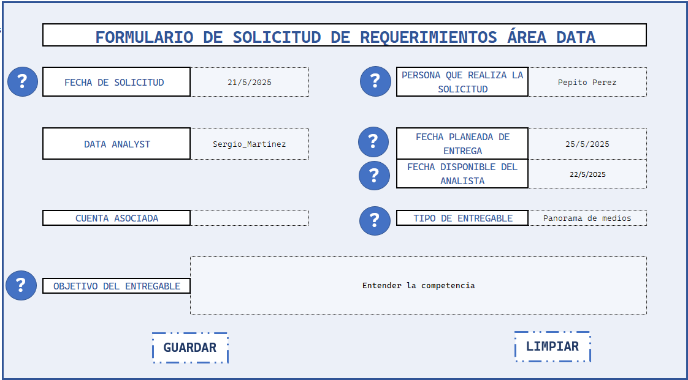
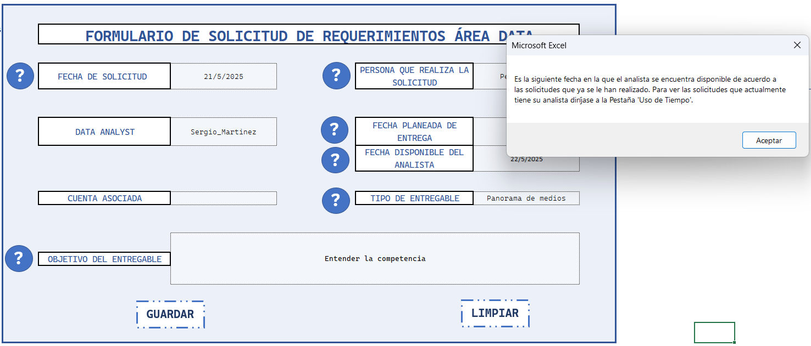

# 📊 Seguimiento de Tiempo Automatizado en Excel + VBA

**Descripción:**  
Herramienta creada en Excel con macros en VBA para registrar, organizar y visualizar el seguimiento de tareas mediante un formulario dinámico y un diagrama de Gantt actualizado automáticamente.

---

## 🚀 Funcionalidades principales

- ✅ Formulario VBA para registrar tareas de forma rápida e intuitiva
- 📅 Diagrama de Gantt automatizado con fechas dinámicas
- 👥 Asignación de responsables, duración y estado de las tareas
- 📈 Panel de métricas clave por equipo o periodo
- 💾 Actualización y almacenamiento automatizado con macros

---

## 🧰 Tecnologías y herramientas

| Herramienta | Descripción |
|-------------|-------------|
| Excel       | Interfaz y almacenamiento de datos |
| VBA         | Automatización de tareas, formularios, lógica de negocio |
| PowerQuery (opcional) | Limpieza de datos si se integra a otros dashboards |

---

## 🖼️ Capturas del proyecto

<h3>Vista del Formulario de Registro de Tareas</h3>

<h3>Vista del Seguimiento de Registro de Tareas</h3>

<h3>Vista de Botones de Formulario de Registro de Tareas</h3> 

---

## 🧠 Aprendizajes clave

- Uso práctico de VBA para automatizar tareas repetitivas
- Creación de formularios dinámicos con validaciones
- Lógica de fechas para visualización en Gantt

---

## 🗂️ Estructura del repositorio
seguimiento-tiempo-vba/
├── README.md
├── SeguimientoTiempos.xlsm
├── Capturas/
│ ├── formulario.png
│ ├── gantt.png
├── VBA/
│ └── Codigo_VBAExcel.txt

## 🙋 Sobre mí

👨‍💻 Sergio Martínez  
*Data Scientist | Machine Learning | Automatization*  
📫 smartinezx99@gmail.com | [LinkedIn]([https://linkedin.com/in/tu-perfil](https://www.linkedin.com/in/sergio-mart%C3%ADnez-b26301176/))
